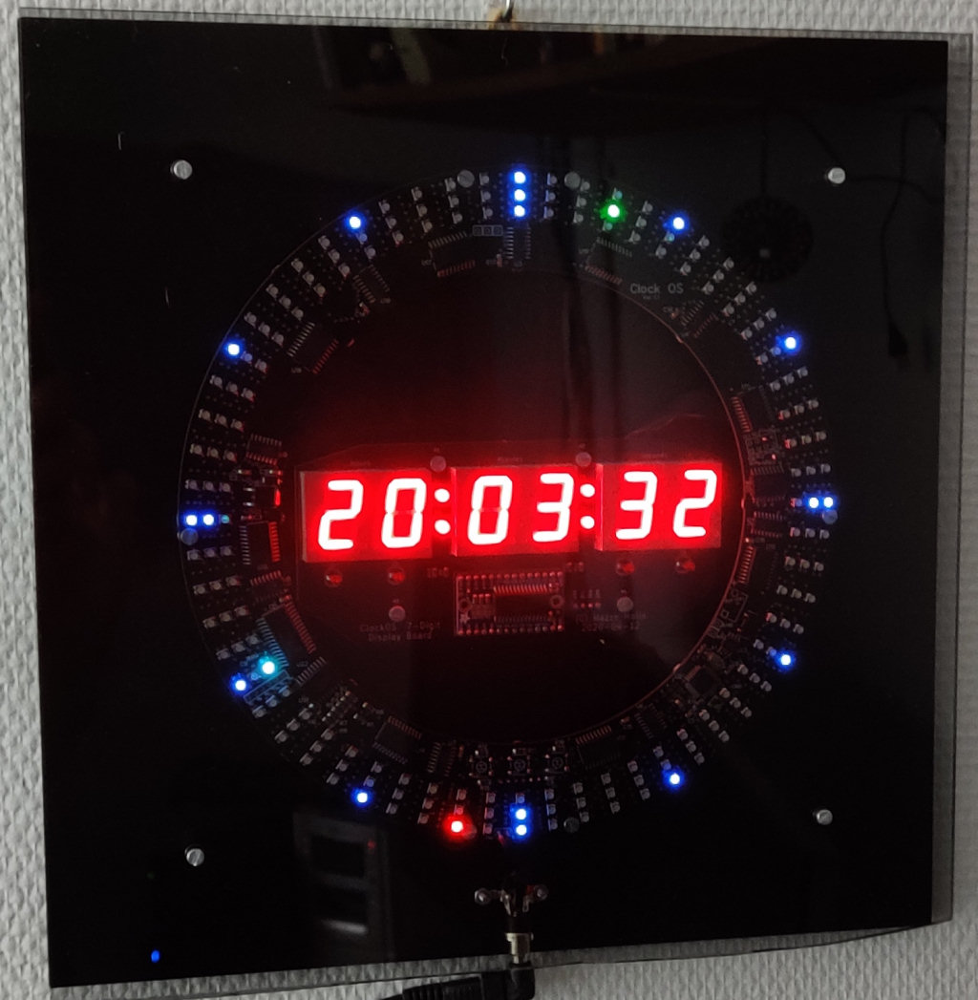
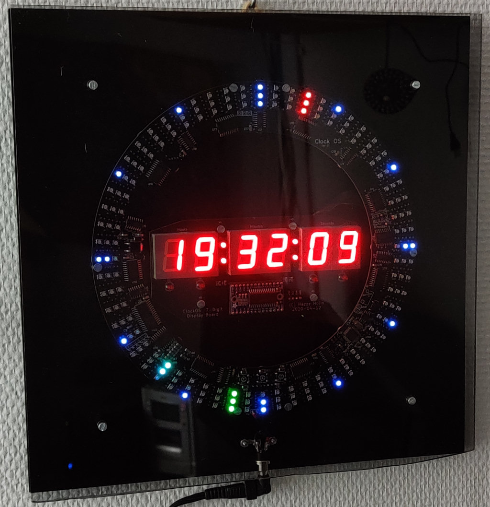
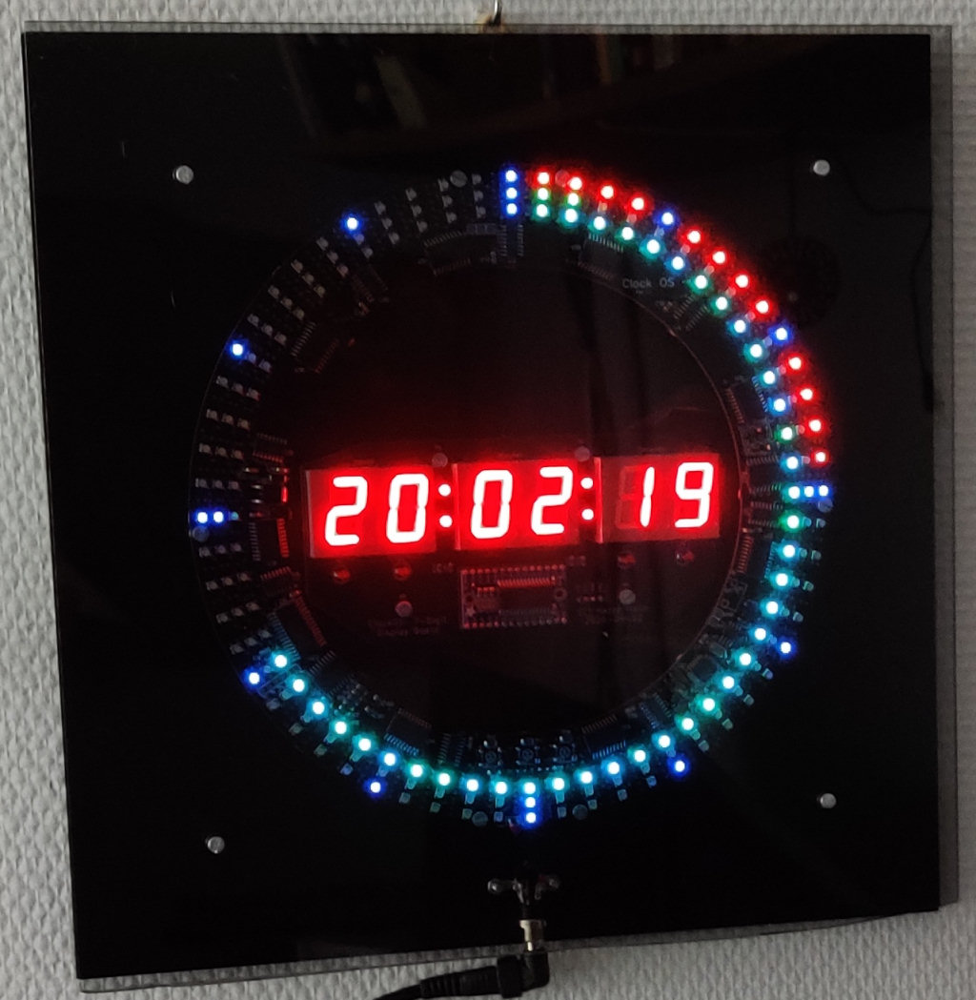
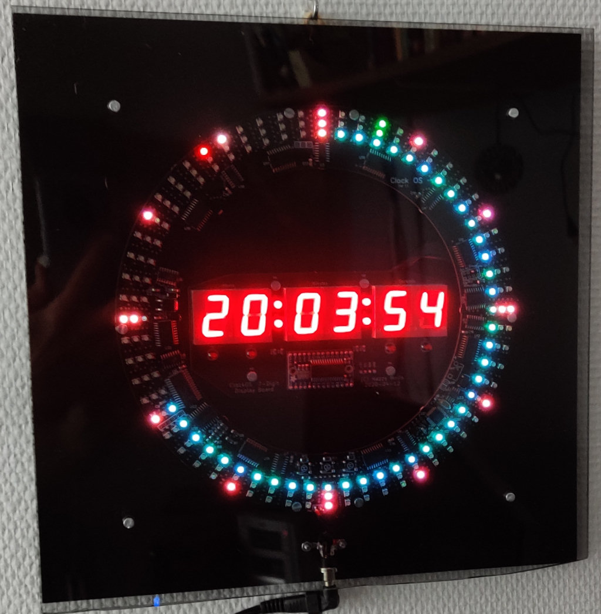
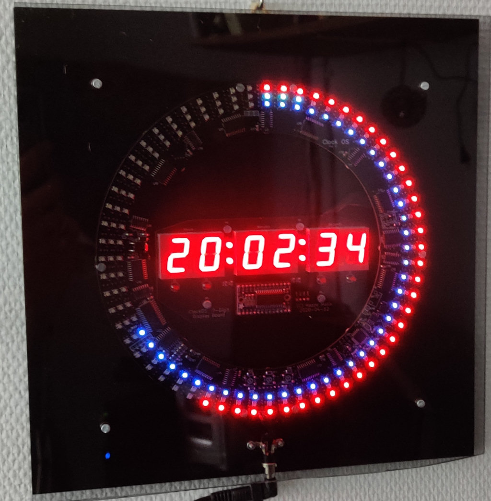
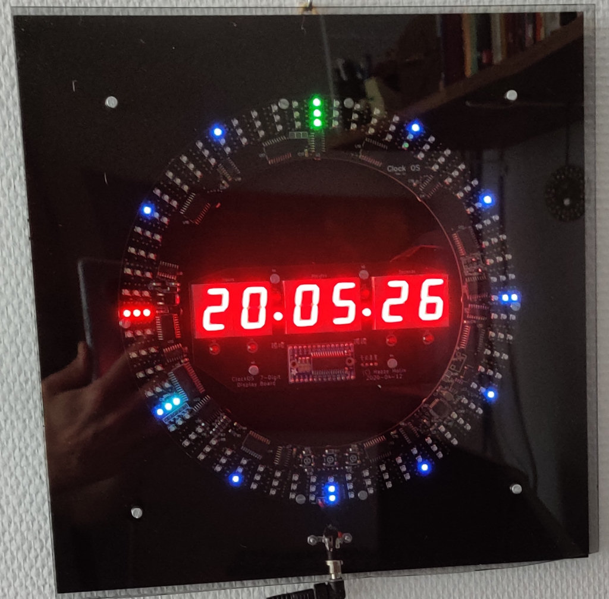
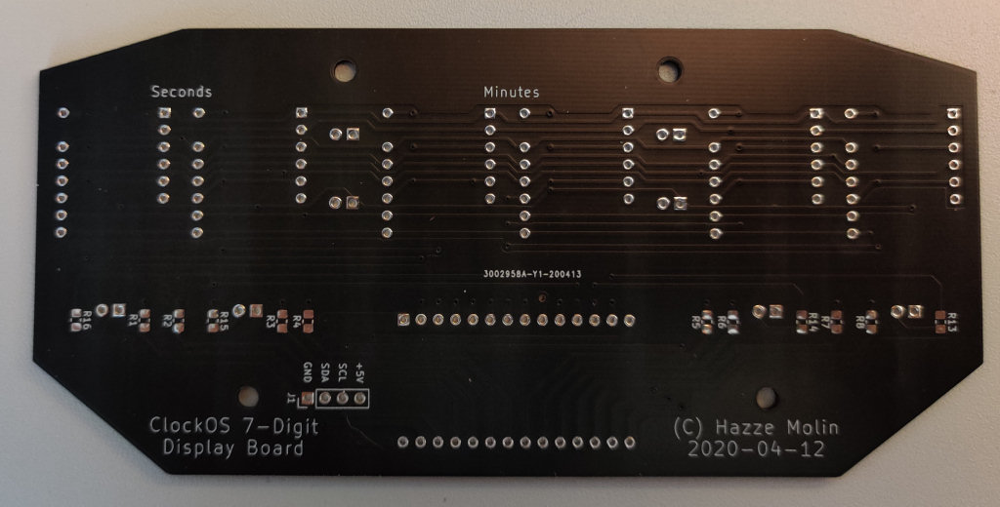
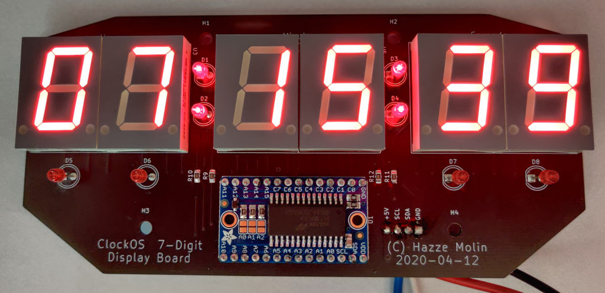
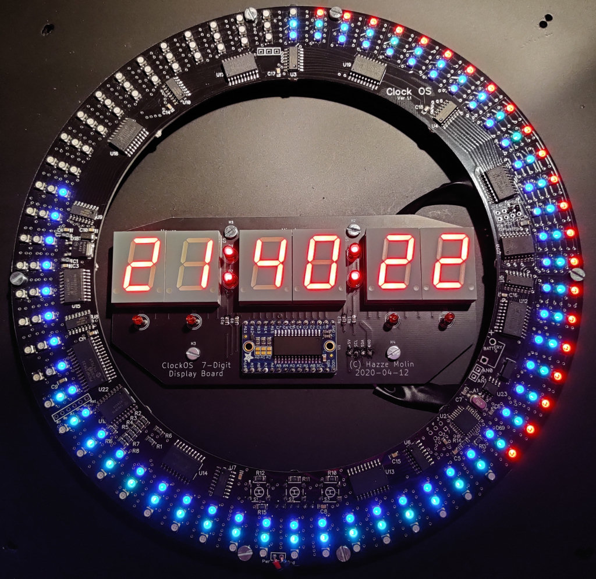

# Clock OS with Display
For some time I wanted to add a time and date display to the ClockOS board that I bought in April 2015. The original [ClockOS was a Kickstarter project](https://www.kickstarter.com/projects/threetree/clockos-rgb-led-clock-arduino-programable-0) and consists of the outer ring with the Arduino microprocessor, and 3×60 RGB LEDs for displaying hours, minutes and seconds. Five years later I finally got round to actually creating a small board on which I have mounted the display using 7-segment LEDs.

The ClockOS, now considered as abandonware, is based on the Arduino and I had the [original source code](https://github.com/willscott/clockOS), so it was no problem extending the original code to also include the code needed to control the display. I actually rewrote most of the code to make it more efficient and to add the functionality for the display.

The display is based on the Holtek HT16K33 chip which communicates with the host microcontroller using I2C and there are Arduino libraries available to support this chip making it very easy to implement.

Below are some images of the board in making and also some examples of different configurations that is possible and can easily be changed using a very simple menu system which is navigated by three buttons on the backside of the ClockOS board.

    
    
    
    
    
    
    
    
    

## Features
* Enhanced version of original ClockOS with support for required 7-segment display board
  connecting a HT16K33 to I2C for displaying time/date and easy configuration.
* Simple menu system to set date and time, and program clock faces.
* You can mix and match "dot", "trace", and small "hands" in every clock face.
* You can select markers for every "hour", "quarter", or "twelth" position only.
* You can select if the time colons should flash or be static.
* You can choose to display time only, date only, or alternating time and date.
* The alternation speed can be selected in steps of every 1, 2, 5, 10, 15, 30, 60 seconds.

## Buttons functionality legend
### Clock mode
* Button 3 - Next clock style (0-9)
* Button 2 - Enter menu
* Button 1 - Previous clock style (0-9)

### Menu
* Button 3 - Next menu (1-3)
* Button 2 - Enter
* Button 1 - Previous menu (1-3)

#### **Menu 1 - Set Time and Date**
    * Set Hour, Minutes, Seconds
        * Button 3 - Up
        * Button 2 - Enter
        * Button 1 - Down
    * Set Year, Month, Day
        * Button 3 - Up
        * Button 2 - Enter
        * Button 1 - Down
#### **Menu 2 - Config display**
    * Set Startup Face - Clock style (0-9)
    * Set Display      - None, Time, Date, Time & Date alternating
    * Set Speed        - Choose alternating speed in seconds
    * Set Colons       - On or Flashing
#### **Menu 3 - Config current clock style**
    * Set Hours
        * Button 3 - Change colors  (0-disable)
        * Button 1 - Hand, Dot, Trace
    * Set Minutes
        * Button 3 - Change colors  (0-disable)
        * Button 1 - Hand, Dot, Trace
    * Set Seconds
        * Button 3 - Change colors  (0-disable)
        * Button 1 - Hand, Dot, Trace
    * Set Markers
        * Button 3 - Change colors  (0-disable)
        * Button 1 - Quarterly, Hourly, Twelve only

### Reset factory settings
    * Button 1 & 2 - Hold down until full red circle is completed for reset to factory settings

### Programming mode    
    * Button 1 & 2 & 3 - PIC standby for programming Arduino (PIC is also reading the buttons)
        * Button 1 - Exit PIC standby

## Hardware
Here is the [ClockOS - 7-Segment Display Board rev 1.1 - schematics](docs/ClockOS+-+7-Segment+Display+Board+rev+1.1+-+schematics.pdf) (pdf) for this construction.

### Parts used for this project
- 1 pcs ClockOS board (Arduino based)
- 1 pcs ClockOS 7-Digit display board (custom design by Hazze Molin)
- 1 pcs Holtek HT16K33 16×8 I2C LED drivers
- 6 pcs SC08-11SURKWA 7 segment red LED-displays
- 8 pcs 3mm LEDs (red or any colour combination you like)
- 16 pcs 0ohm 0.25W resistors (adjust resistances depending on actual LEDs used)
